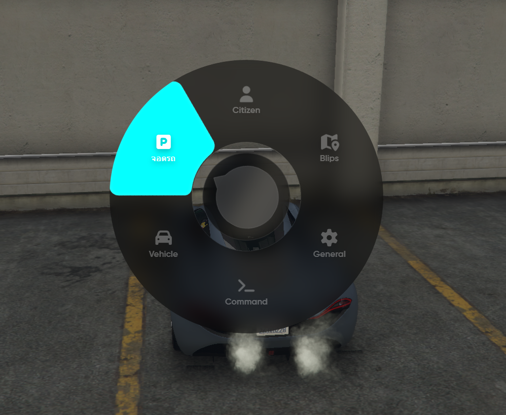

# 🚗 ระบบการจอดรถ

ในเมือง **North Valley** เราใช้ระบบ **nx-parking** ซึ่งช่วยให้คุณสามารถจอดรถไว้ที่ไหนก็ได้ในเมือง (ที่สมจริง) โดยระบบจะจดจำตำแหน่งและสภาพรถของคุณไว้อย่างแม่นยำ

***

### 🅿️ การจอดรถ (How to Park)

เมื่อคุณต้องการจอดรถทิ้งไว้ในจุดต่างๆ:

1. **หยุดรถให้สนิท:** คุณต้องเป็นคนขับและรถต้องหยุดนิ่ง
2. **ใช้เมนูวงกลม (Radial Menu):** กด `F1` > เลือก **"จอดรถ" (Park Vehicle)**
3. **ใช้คำสั่ง:** หรือพิมพ์คำสั่ง `/park` ในแชท

* **หมายเหตุ:** ระบบจะบันทึกค่าน้ำมัน, สภาพเครื่องยนต์ และสภาพตัวถังไว้ทั้งหมด

<figure><figcaption></figcaption></figure> <figure><figcaption></figcaption></figure>

***

### 🔑 การนำรถออก (Retrieving Your Vehicle)

คุณสามารถนำรถกลับมาใช้งานได้ 2 วิธี:

1. **ไปที่จุดจอด:** เดินไปที่รถแล้วใช้สายตา (**Left Alt**) เล็งที่รถ > เลือก **"นำรถออก"**
2. **ใช้ระบบ GPS:** หากจำที่จอดไม่ได้ ให้เปิดเมนู **"รถที่จอดของฉัน"** ใน Radial Menu แล้วเลือก **"ตั้ง GPS ไปยังจุดจอด"**

Ex . ใช่ eye target มองไปที่รถที่จอดอยู่

<figure><figcaption></figcaption></figure>

Ex . ใช่ **Radial Menu ไปที่รายการรถ และ เลือกรถที่อยู่ในระบบจอด**

<figure><figcaption></figcaption></figure> <figure><figcaption></figcaption></figure> <figure><figcaption></figcaption></figure>

***

### 🏢 สถานีตำรวจสาธารณะ (Depot)

หากรถของคุณหายไป หรือถูกส่งไปยังสถานีตำรวจสาธารณะ (ไม่ใช่การโดนยึด):

* **สถานที่:** คุณสามารถไปที่ **Legion Depot** (จุดหลักใกล้จัตุรัสกลางเมือง)
* **ค่าธรรมเนียม:** อาจมีค่าธรรมเนียมในการนำรถออก (Depot Fee) ตามที่สภานักศึกษากำหนด
* **การใช้งาน:** คุยกับ NPC ที่จุด Depot > เลือก **"ดูรถที่รอการนำออก"**

<figure><figcaption></figcaption></figure>

***

### 🚨 การถูกยึดรถโดยเจ้าหน้าที่ (Police Impound)

หากคุณจอดรถผิดกฎจราจรในแคมปัส หรือทำผิดกฎหมายร้ายแรง รถจะถูกยึด:

* **ข้อหาที่พบบ่อย:**
  * จอดรถกีดขวางจราจร ($500 / 30 นาที)
  * ขับรถโดยไม่มีใบขับขี่ ($1,000 / 60 นาที)
  * รถต้องสงสัยก่ออาชญากรรม ($5,000 / 240 นาที)
* **วิธีรับรถคืน:** ต้องรอให้ครบกำหนดเวลา และชำระค่าปรับที่ **เจ้าหน้าที่สถานีตำรวจ (Impound Officer)**

***

### ⚠️ ข้อควรระวัง (Parking Rules)

* **No Parking Zones:** ห้ามจอดรถในบริเวณที่ระบบกำหนดเป็นเขตห้ามจอด (Red Zones)
* **Job Restrictions:** บางพื้นที่จอดได้เฉพาะรถเจ้าหน้าที่ (เช่น จุดจอดรถหมอ หรือ รถตำรวจ)
* **Vehicle Safety:** หากรถถูกยึด คุณจะเสียเวลาและเงินค่าปรับ โปรดจอดในที่ที่จัดเตรียมไว้ให้

***

> **"จอดรถให้เป็นระเบียบ เพื่อทัศนียภาพที่ดีของมหาวิทยาลัยเรา"**
